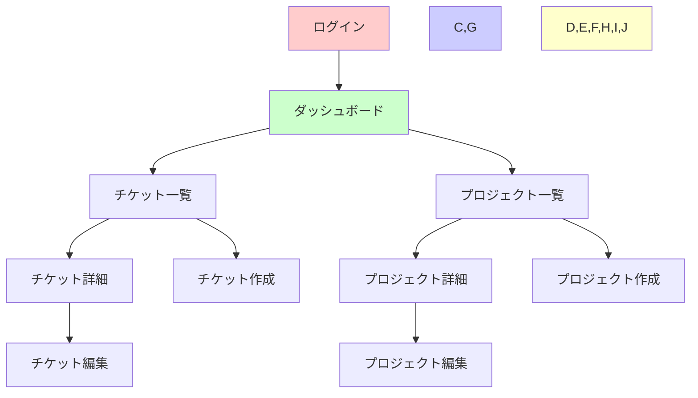
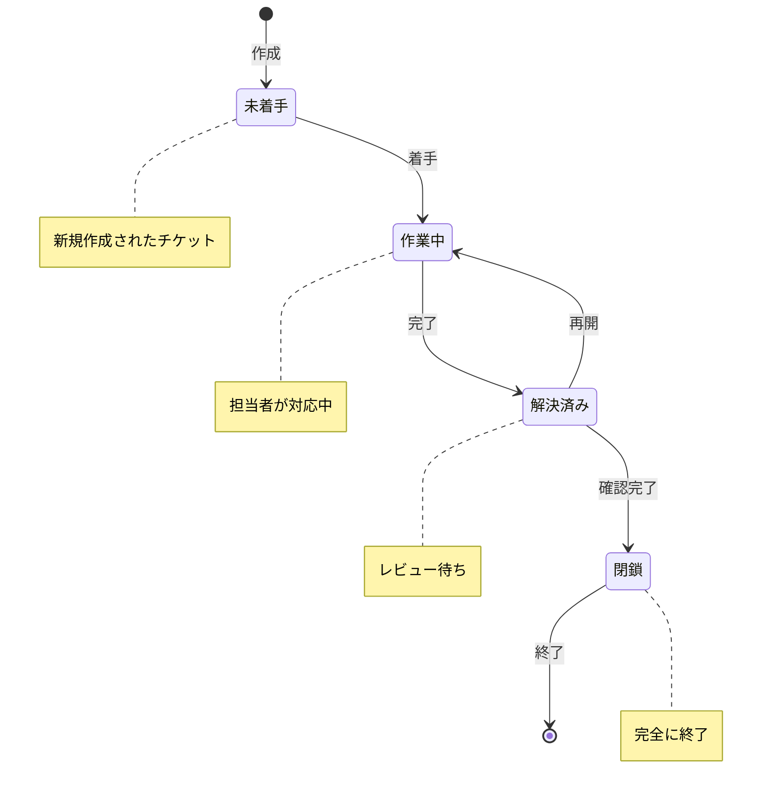

# チケット管理システム

BacklogやRedmineを参考にした、シンプルで使いやすいチケット管理システムです。

## 概要

- **フロントエンド**: React + TypeScript + Tailwind CSS
- **バックエンド**: Ruby on Rails
- **データベース**: MySQL

## 環境構築

### 前提条件
- Node.js (推奨: 16.x以上)
- Ruby (3.2.x以上)
- MySQL

### セットアップ手順

#### バックエンド
```bash
cd backend
bundle install
rails db:create
rails db:migrate
rails db:seed
rails s -p 3001
```

#### フロントエンド
```bash
cd frontend
npm install
npm start
```

### アクセス方法
- フロントエンド: http://localhost:3000
- バックエンドAPI: http://localhost:3001
- Swagger UI: http://localhost:3001/api-docs/index.html

### テスト用アカウント
- 管理者: admin@example.com / password123
- マネージャー: manager@example.com / password123
- 一般ユーザー: user@example.com / password123

## 主要機能

### チケット管理
- チケットの作成・編集・削除
- ステータス管理（未着手、作業中、解決済み、閉鎖）
- 優先度設定（低、中、高、緊急）
- コメント機能

### プロジェクト管理
- プロジェクトの作成・編集・削除
- ステータス管理（計画中、進行中、一時停止、完了、キャンセル）
- 期間設定

### ユーザー管理（管理者向け）
- ユーザーの登録・編集・削除
- 権限管理（管理者、マネージャー、一般ユーザー）

### システム設定（管理者向け）
- 全体設定の管理

## 画面構成



## チケット状態遷移図



## 開発ガイドライン

### コード規約
- フロントエンドのコンポーネント: PascalCase (例: `TicketCard.tsx`)
- バックエンドのモデル: snake_case (例: `ticket.rb`)
- テスト名: 日本語で記述

### テスト
- フロントエンド: `npm test`
- バックエンド: `bundle exec rspec`

## API ドキュメント
詳細なAPI仕様については、Swagger UIを参照してください:
http://localhost:3001/api-docs/index.html