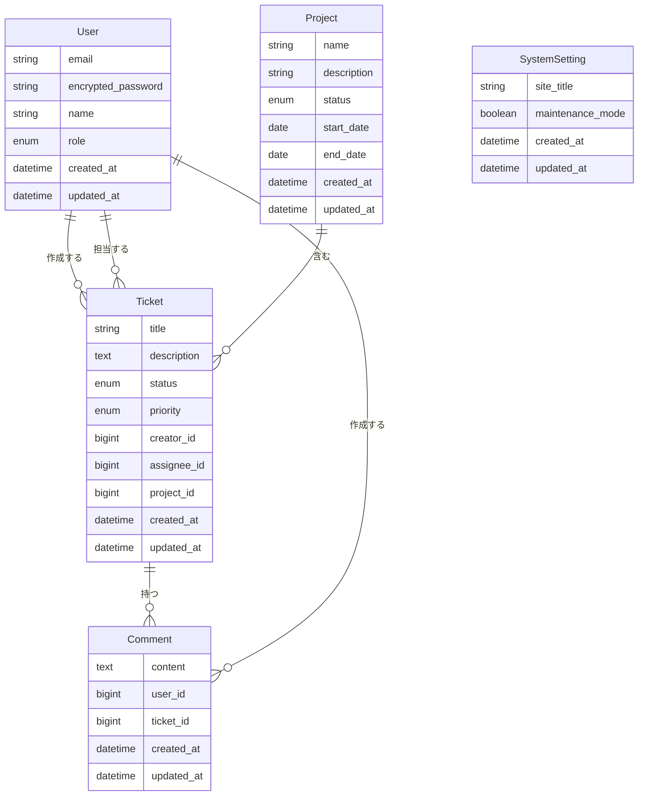

# チケット管理システム（バックエンド）

このプロジェクトは、Ruby on Railsで構築されたチケット管理システムのバックエンドAPIです。

## 技術スタック

- **フレームワーク**: Ruby on Rails API
- **Ruby バージョン**: 3.2.x
- **データベース**: MySQL
- **テスト**: RSpec
- **API ドキュメント**: Swagger UI

## 環境構築

### 前提条件
- Ruby 3.2.x
- MySQL
- Bundler

### セットアップ手順

```bash
# 依存関係のインストール
bundle install

# データベースの作成とマイグレーション
rails db:create
rails db:migrate

# 初期データの投入
rails db:seed

# 開発サーバーの起動
rails s -p 3001
```

### テスト実行

```bash
# すべてのテストを実行
bundle exec rspec

# 特定のテストを実行
bundle exec rspec spec/models/ticket_spec.rb
```

## テスト用アカウント

開発環境では、以下のテスト用アカウントが自動的に作成されます：

- **管理者**: admin@example.com / password123
- **マネージャー**: manager@example.com / password123
- **一般ユーザー**: user@example.com / password123

## API仕様

Swagger UIを使用してAPI仕様を確認できます：

```
http://localhost:3001/api-docs/index.html
```

## データベース構造



## 主要な機能

### 認証・認可
- JWTトークンベースの認証
- ロールベースのアクセス制御

### チケット管理
- 作成、編集、削除
- ステータス管理
- 優先度設定
- 担当者割り当て

### プロジェクト管理
- 作成、編集、削除
- ステータス管理
- チケットとの関連付け

### ユーザー管理
- 作成、編集、削除
- ロール設定

### システム設定
- サイトタイトル設定
- メンテナンスモード設定

## ディレクトリ構造

主要なディレクトリとファイルの説明：

```
app/
├── controllers/        # APIコントローラー
├── models/             # データモデル
├── serializers/        # JSONシリアライザー
├── services/           # ビジネスロジック
├── swagger/            # Swagger API定義
└── validators/         # カスタムバリデーター

config/
├── routes.rb           # ルーティング設定
└── database.yml        # データベース設定

db/
├── migrate/            # マイグレーションファイル
└── seeds.rb            # 初期データ

spec/
├── models/             # モデルテスト
├── controllers/        # コントローラーテスト
├── requests/           # リクエストテスト
└── factories/          # テストデータファクトリ
```

## コード規約

- コントローラー、モデル、その他のファイル名はすべてスネークケース
- テスト名は日本語で記述
- インデントは2スペース
- メソッド名はスネークケース
