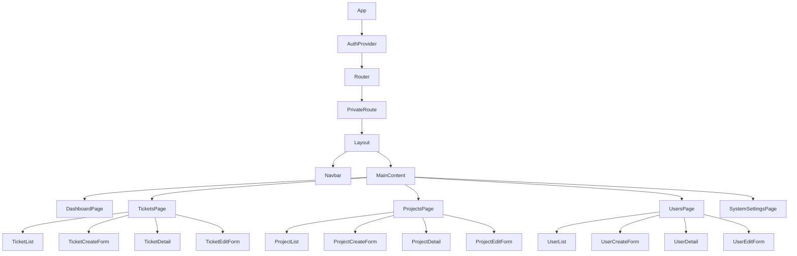

# チケット管理システム（フロントエンド）

このプロジェクトは、React + TypeScriptで構築されたチケット管理システムのフロントエンドです。
Tailwind CSSを使用したシンプルで使いやすいUIを提供しています。

## 技術スタック

- React (Create React App)
- TypeScript
- Tailwind CSS (CDN)
- Jest + React Testing Library

## 主要コンポーネント構成



## 開発環境のセットアップ

```bash
# 依存関係のインストール
npm install

# 開発サーバーの起動
npm start

# テストの実行
npm test

# プロダクションビルドの作成
npm run build
```

## API連携

バックエンドAPIとの連携は、`src/api`ディレクトリ内のモジュールを通じて行われます。
すべてのAPIリクエストは、Axios経由で処理されます。

```typescript
// 例: チケット一覧の取得
import { fetchTickets } from '../api/tickets';

const MyComponent = () => {
  const [tickets, setTickets] = useState([]);
  
  useEffect(() => {
    const getTickets = async () => {
      const data = await fetchTickets();
      setTickets(data);
    };
    
    getTickets();
  }, []);
  
  // ...
};
```

## テスト方針

- コンポーネントの基本的な機能と表示を検証するユニットテスト
- 主要なユーザーフローを検証する統合テスト
- モックを使用したAPI連携のテスト

```bash
# 全テストを実行
npm test

# 特定のテストファイルを実行
npm test -- src/components/TicketList.test.tsx

# カバレッジレポートを生成
npm test -- --coverage
```

## フォルダ構造

```
src/
├── api/            # APIリクエスト関連のモジュール
├── assets/         # 静的アセット（画像など）
├── components/     # 再利用可能なコンポーネント
├── context/        # Reactコンテキスト
├── hooks/          # カスタムフック
├── pages/          # ページコンポーネント
├── types/          # TypeScript型定義
└── utils/          # ユーティリティ関数
```

## Create React App情報

このプロジェクトは [Create React App](https://github.com/facebook/create-react-app) を使用して構築されています。
詳細は [Create React App documentation](https://facebook.github.io/create-react-app/docs/getting-started) を参照してください。
